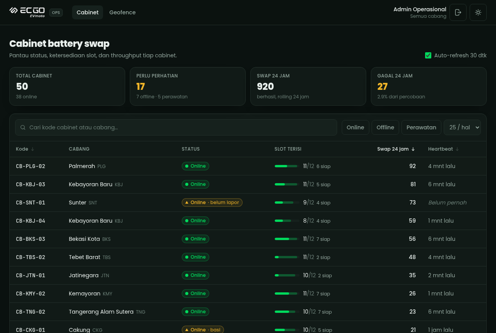
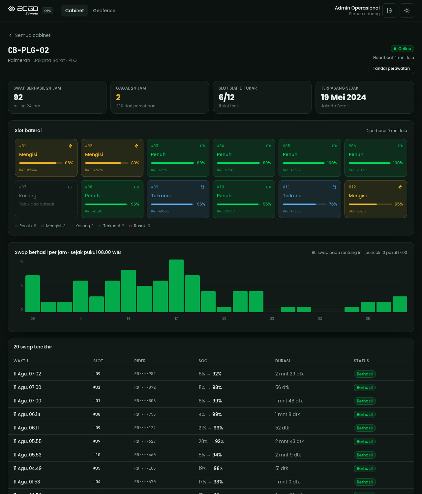
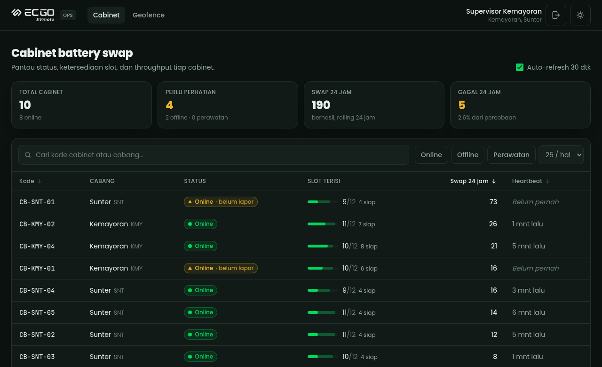
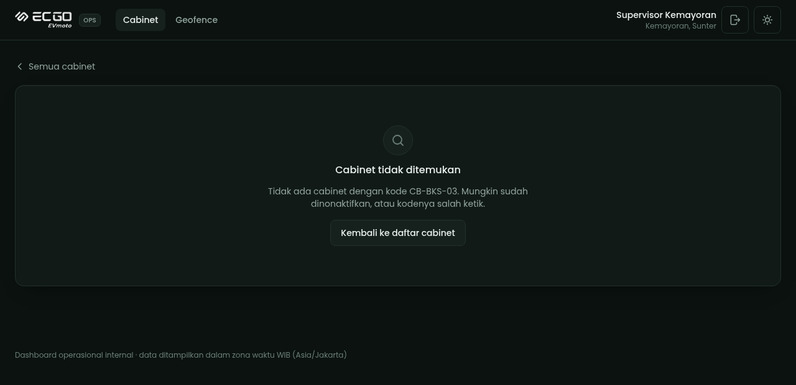
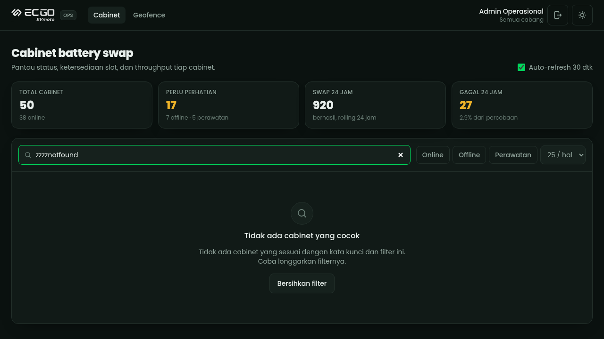
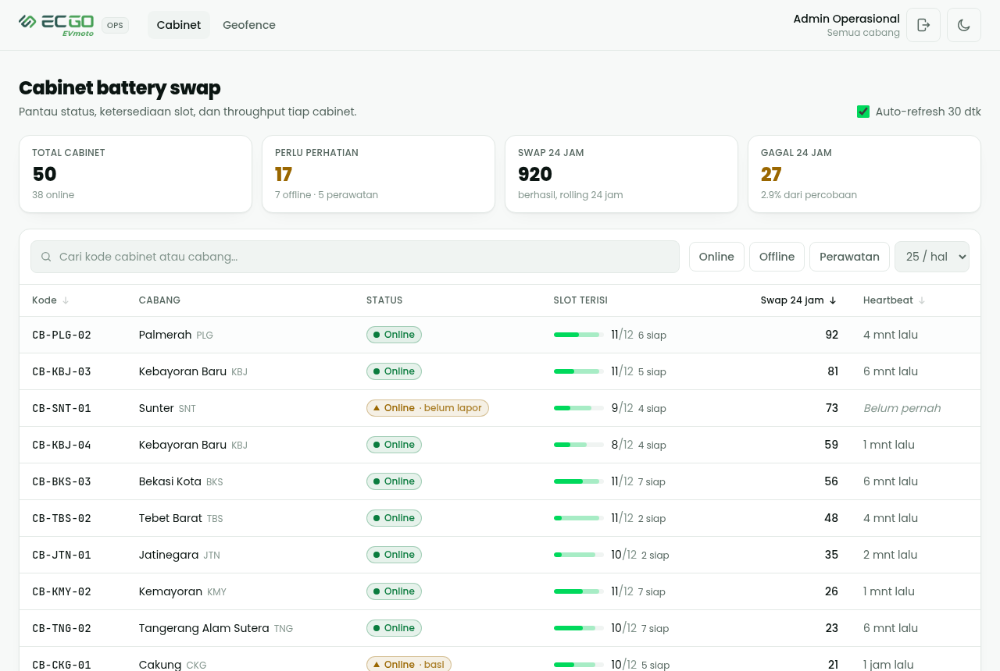
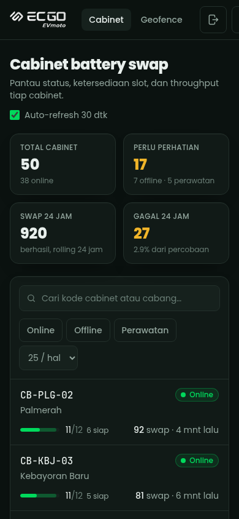
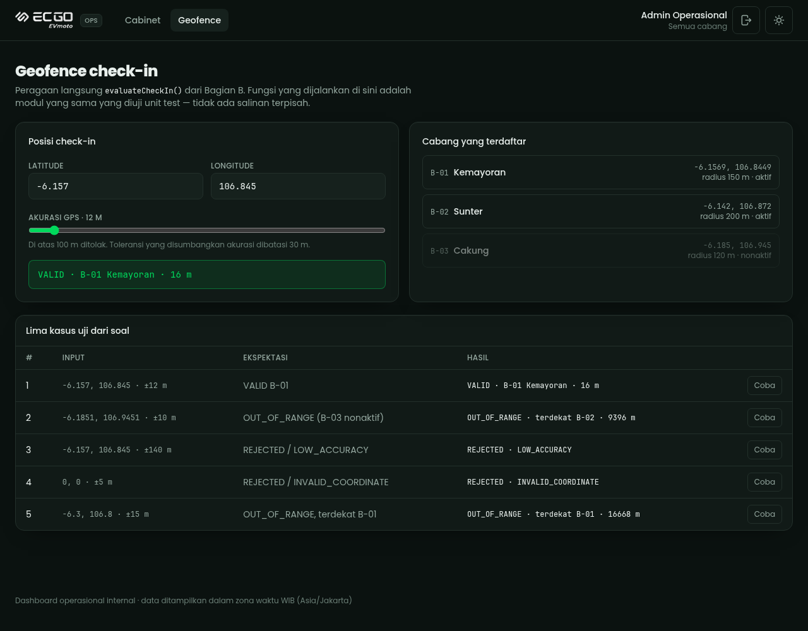
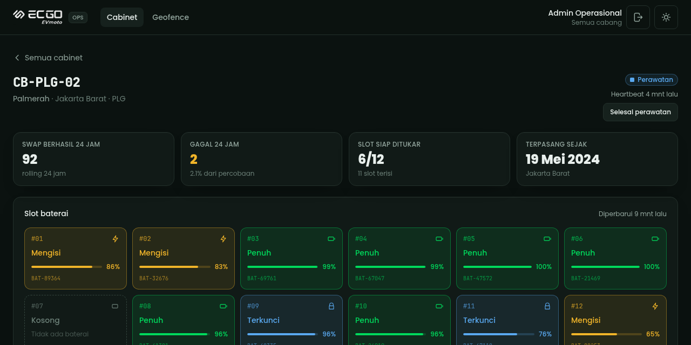
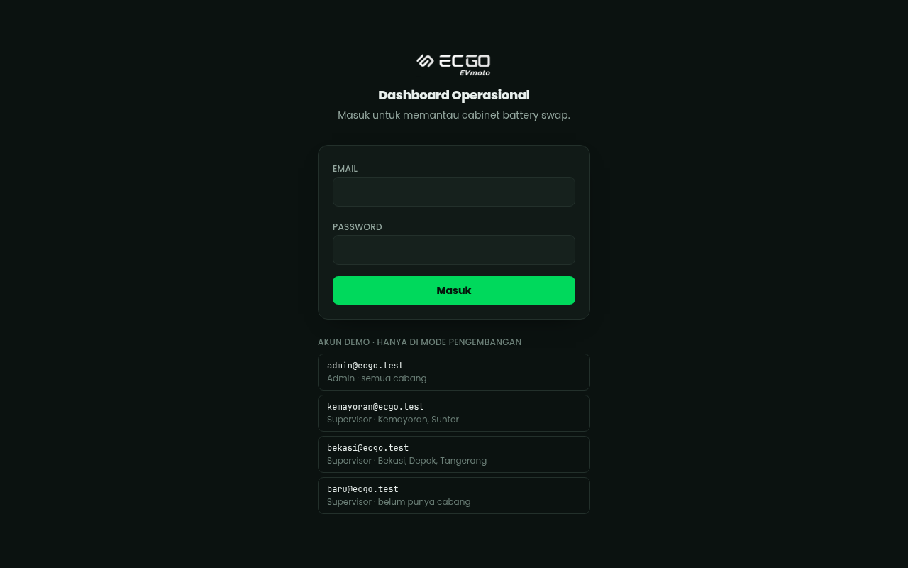

# ECGO — Battery Swap Monitoring Dashboard

Jawaban untuk **TEST-ENG-FS-001 · Fullstack Developer (Web)**
Kandidat: **Ade Rusmana** · adeforgaming@gmail.com

| Field | Isi |
| --- | --- |
| Nama lengkap | Ade Rusmana |
| Email | adeforgaming@gmail.com |
| Nomor WhatsApp | +62 812-9669-7727 |
| Tanggal mulai mengerjakan | 10 Agustus 2026 |
| Tanggal selesai | 10 Agustus 2026 |
| AI tool yang dipakai | Claude Code (Opus) — rincian per bagian di §10 |
| Repo | https://github.com/adehuh/ecgo-ops-dashboard |
| Ketersediaan Live Defense | **Kamis, 13 Agustus 2026, pukul 10.00 WIB** |

---

## 1. Isi repositori ini

| Bagian | Bentuk | Lokasi |
| --- | --- | --- |
| **A** — Konsep & Fundamental | Tulisan | [`docs/A-konsep.md`](docs/A-konsep.md) |
| **B1** — Geofence check-in | Kode + 36 test | [`shared/geofence/evaluateCheckIn.ts`](shared/geofence/evaluateCheckIn.ts) · [`tests/geofence.spec.ts`](tests/geofence.spec.ts) |
| **B2/B3** — Skala & PostGIS | Tulisan | [`docs/B-scaling.md`](docs/B-scaling.md) |
| **C** — Code review & security | Tulisan + kode | [`docs/C-code-review.md`](docs/C-code-review.md) |
| **D** — Dashboard | Aplikasi | `src/`, `server/`, `db/`, `scripts/` |
| — | Spesifikasi yang saya tulis sebelum ngoding | [`SPEC.md`](SPEC.md) |

Bagian B1 juga bisa dicoba langsung di browser pada halaman **`/geofence`** — halaman
itu meng-import modul yang sama persis yang diuji unit test, bukan salinannya.

### Pemenuhan requirement Bagian D

Diperiksa terhadap aplikasi yang berjalan, bukan dari ingatan.

| Aspek (dari soal) | Status | Bukti |
| --- | --- | --- |
| **Stack** — Next.js 15 + TS + Tailwind + PostgreSQL | ⚠️ **menyimpang pada framework** | TypeScript strict ✅ · Tailwind 4.3 ✅ · PostgreSQL 16 ✅ · **Next.js → Vue 3 SPA + Express 5**, dibela di §3 |
| **Seed data** — min 50 cabinet / 600 slot / 20.000 swap / 30 hari / satu perintah | ✅ | 50 · 600 · **22.000** · 30 hari · `npm run seed` |
| **API** — min 2 route handler, Zod, error konsisten | ✅ | 8 handler · 15 skema Zod · `VALIDATION_ERROR` 400 · `UNAUTHORIZED` 401 · `NOT_FOUND` 404 · `CONFLICT` 409 · `TOO_MANY_REQUESTS` 429 · `INTERNAL` 500 |
| **UI state** — loading, empty, error | ✅ | ketiganya di kedua halaman; empty dibedakan "tidak cocok filter" vs "belum ada data" |
| **Query** — nol N+1, agregasi di database | ✅ | daftar = **1 query** (2 CTE + join, `count(*) OVER ()`); detail = 4 query paralel; nol `.reduce()` atas baris swap di server; `EXPLAIN ANALYZE` di §6 |
| **README** — setup, asumsi, trade-off, belum selesai, AI tool | ✅ | §2 · §7 · §8 · §9 · §10 |
| **Git** — commit bertahap, pesan bermakna | ✅ | 13 commit berlapis, tidak ada "initial commit" tunggal |

Satu baris menyimpang, dan hanya pada satu kata: **framework**. Tiga syarat lain di
baris Stack terpenuhi apa adanya. Alasan dan risikonya ada di §3 — ringkasnya, soal
memuat dua kalimat yang bertabrakan, dan saya memilih kalimat yang menyebut Vue dan
Express secara nama karena Sesi 3 menuntut saya menjelaskan tiap baris tanpa AI.

### Bonus yang dikerjakan

Soal menandai ini opsional dan hanya dinilai kalau yang wajib sudah lengkap.

| Bonus | Status | Di mana |
| --- | --- | --- |
| **Unit / E2E test** | ✅ keduanya | 86 test Vitest (36 geofence · 24 kontrak API · 26 auth) + **23 test Cypress** end-to-end |
| **Optimistic UI** | ✅ | tombol "Tandai perawatan" di halaman detail — lihat §7.13 |
| **Skeleton loading** | ✅ | skeleton berbentuk sama dengan tabel yang menggantikannya, jumlah barisnya mengikuti `pageSize` |
| **Dark mode** | ✅ | default gelap, tombol di header, dipasang dari cookie sebelum paint pertama |
| **Auto-refresh** | ✅ | polling 30 detik, berhenti saat tab tidak terlihat |
| Deploy ke Vercel | ❌ | belum — lihat §9 |

### Tampilan

Bukan tangkapan layar untuk setiap fitur — hanya yang **membuktikan sebuah keputusan**
yang saya tulis di §7. Semuanya diambil dari aplikasi yang berjalan, bukan mockup.

| | |
| --- | --- |
|  **Daftar cabinet.** Badge "Online · basi" dan "Online · belum lapor" adalah §7.4 dan §7.5: cabinet yang mengaku sehat tapi diam terlalu lama tidak boleh terlihat sama dengan yang benar-benar sehat. |  **Detail.** Banner basi (§7.3) — data terakhir tetap ditampilkan, tapi ditandai. Slot kosong tertulis "Tidak ada baterai", bukan 0% (§7.6). |
|  **Ruang lingkup cabang.** Supervisor Kemayoran melihat **10** cabinet, bukan 50 — termasuk KPI di atasnya. Ruang lingkupnya ditulis permanen di header supaya tidak ada yang salah membaca angka ini sebagai angka armada. |  **404, bukan 403** (§7.12). Membuka cabinet milik cabang lain secara langsung menghasilkan jawaban yang tidak bisa dibedakan dari "cabinet tidak ada". |
|  **Empty state.** Dibedakan dari error dan dari "belum ada data", dan menawarkan jalan keluar alih-alih jalan buntu. |  **Tema terang.** Dipasang dari cookie oleh skrip di `<head>`, jadi tidak ada kilatan putih saat memuat. |
|  **Ponsel.** Tabel enam kolom tidak bisa dipakai di lapangan, jadi di bawah breakpoint `md` ia berganti menjadi kartu. |  **Bagian B, hidup.** Halaman `/geofence` menjalankan `evaluateCheckIn()` yang sama persis dengan yang diuji 36 unit test. |
|  **Optimistic UI** (§7.13). Badge dan tombol berbalik seketika saat diklik, sebelum server menjawab; kalau server menolak, keadaannya dikembalikan beserta alasannya. Ada test Cypress khusus untuk rollback-nya. | |

 **Masuk.** Daftar akun demo hanya dirender saat `import.meta.env.DEV` — Vite membuangnya dari bundel produksi, bukan sekadar menyembunyikannya.

---

## 2. Menjalankan dari nol

Butuh **Node ≥ 20.19** dan **Docker**.

```bash
cp .env.example .env
npm install
docker compose up -d      # PostgreSQL 16 di port 55432
npm run db:migrate        # jalankan db/migrations/*.sql
npm run seed              # 12 cabang · 50 cabinet · 600 slot · 22.000 swap · 4 pengguna
npm run dev               # API :3001 + client Vite :3000 → buka http://localhost:3000
```

`npm run dev` menjalankan dua proses sekaligus lewat `concurrently`: API Express dan
dev server Vite. Vite mem-proxy `/api` ke Express, jadi **browser hanya pernah
melihat satu origin** — itu bukan kenyamanan belaka, melainkan yang membuat cookie
sesi `HttpOnly; SameSite=Lax` terkirim apa adanya tanpa CORS.

### Akun demo

Dicetak juga oleh `npm run seed`. Hanya untuk lokal.

| Email | Password | Peran | Melihat |
| --- | --- | --- | --- |
| `admin@ecgo.test` | `ops-admin-2026` | ADMIN | seluruh armada (50 cabinet) |
| `kemayoran@ecgo.test` | `ops-kemayoran-2026` | SUPERVISOR | Kemayoran, Sunter (10) |
| `bekasi@ecgo.test` | `ops-bekasi-2026` | SUPERVISOR | Bekasi, Depok, Tangerang |
| `baru@ecgo.test` | `ops-baru-2026` | SUPERVISOR | **belum punya cabang — sengaja** |

Masuk sebagai `kemayoran@ecgo.test` lalu buka `/cabinets/CB-BKS-03` secara langsung:
hasilnya **404**, bukan 403. Alasannya di §7.

### Perintah lain

```bash
npm test            # 86 test Vitest (36 geofence + 24 kontrak API + 26 auth)
npm run test:e2e    # 23 test Cypress end-to-end (aplikasi harus sedang berjalan)
npm run typecheck   # vue-tsc untuk client, tsc untuk server
npm run build       # dist/client (SPA) + dist/server (API)
npm start           # produksi: satu proses, satu port, API + SPA
npm run db:reset    # buang schema, migrasi ulang dari nol
npm run simulate    # opsional — lihat §2.1
```

### 2.1 `npm run simulate` — dan kenapa ada

Jalankan di terminal terpisah, biarkan hidup:

```bash
npm run simulate
```

Seed menulis heartbeat sebagai **stempel waktu absolut**. Cabinet sungguhan mengirim
heartbeat terus-menerus; data seed tidak. Jadi sepuluh menit setelah `npm run seed`,
seluruh armada melewati ambang basi dan dashboard menampilkan **50 cabinet kuning** —
bukan karena kodenya salah, melainkan karena data statis menua sementara "sekarang"
terus berjalan. Saya menemukan ini saat membuka halaman daftar 20 menit setelah
menyemai; layarnya waktu itu menunjukkan "Perlu perhatian: 50".

Simulator menjadikan armadanya hidup — heartbeat berdetak, swap baru masuk — sehingga
angka 24 jam dan indikator basi berperilaku seperti di produksi. Ia sengaja **proses
terpisah, bukan cron di dalam server**: di produksi, satu-satunya yang berhak menulis
kolom heartbeat adalah cabinet-nya sendiri, dan aplikasi tidak boleh punya jalur kode
untuk memalsukannya.

Kalau tidak ingin menjalankannya, cukup `npm run seed` ulang sebelum melihat dashboard.

---

## 3. Pilihan stack — dan penyimpangan yang saya ambil

**Vue 3 (Composition API) · Vite · Vue Router · Pinia · TypeScript strict ·
Tailwind CSS v4 · Express 5 · PostgreSQL 16 · Zod · Vitest**

Tabel "Wajib ada" di Bagian D menyebut Next.js 15. Bagian "Konteks produk & stack"
di dokumen yang sama menyebut: *"Kalau pengalamanmu di stack lain (Laravel/Vue/Nuxt/
Express), tetap kerjakan — untuk Bagian B dan D kamu boleh pakai stack yang kamu
kuasai asalkan TypeScript, dan tulis di README."*

Kedua kalimat itu bertabrakan, jadi saya harus memilih dan menyatakannya terbuka.
**Saya memilih Vue SPA + Express**, dan keduanya disebut namanya di kalimat izin itu.

Alasannya satu dan sederhana: **Sesi 3 mewajibkan saya menjelaskan setiap baris tanpa
bantuan AI dan melakukan perubahan live.** Stack ini persis yang saya pakai
sehari-hari — Vue 3 dengan Composition API, Vue Router, Pinia, dan Vite, kira-kira
900 komponen Vue di beberapa produk. Mengirimkan Next.js yang saya tulis sambil
belajar akan lolos di kertas dan gugur di sesi itu.

Semua syarat lain dipenuhi apa adanya: TypeScript strict, Tailwind, PostgreSQL, Zod.

### Konsekuensi memilih SPA, bukan framework SSR

Ini pertanyaan yang wajar diajukan penilai, jadi saya jawab di muka. SPA memang
kehilangan sesuatu dibanding Next.js atau framework SSR lain:

| Hilang | Konsekuensi nyata | Bagaimana ditangani di sini |
| --- | --- | --- |
| Server-side rendering | HTML awal kosong; SEO dan first paint bergantung pada bundel | Dashboard internal di balik login — SEO tidak relevan. Diukur di Chrome: FCP 52 ms, CLS 0 (§6). |
| Tema dari server | Kilatan putih saat memuat halaman | Skrip sinkron 6 baris di `<head>` `index.html`, berjalan sebelum paint pertama |
| Pengambilan data bawaan framework | Harus ditulis sendiri | `src/composables/useApi.ts` — 60 baris, dengan pembatalan `AbortController` yang eksplisit dan pemeriksaan nomor urut permintaan |
| Auto-import | Semua import ditulis tangan | Lebih berisik satu kali, tapi "ini datang dari mana?" bisa dijawab tanpa menebak |
| Routing berbasis folder | Rute harus didaftarkan | `src/router/index.ts` — satu berkas yang bisa dibaca untuk menjawab "rute apa saja yang ada, dan mana yang publik" |
| Satu proses saat dev | Dua proses | `concurrently`, tetap satu `npm run dev` |

Yang justru **didapat**: batas client/server jadi tegas dan kasatmata — `src/`
seluruhnya browser, `server/` seluruhnya Node, dan hanya kode murni di `shared/`
yang boleh dipakai keduanya. Tidak ada kode yang "kebetulan" berjalan di dua tempat.
Total dependensi 250 paket.

**Catatan riwayat.** Beberapa commit pertama repo ini memakai Nuxt sebelum saya pindah
ke Vue murni + Express. Riwayatnya sengaja tidak saya tulis ulang, jadi `git log` masih
menunjukkan perpindahan itu apa adanya. Yang ikut pindah tanpa berubah sama sekali:
seluruh SQL, `evaluateCheckIn` beserta 36 test-nya, skema Zod di `shared/contracts/`,
dan semua komponen Vue.

---

## 4. Arsitektur

```
src/                     Vue 3 SPA
  api/client.ts            pembungkus fetch + amplop error
  composables/useApi.ts    pengambilan data reaktif + pembatalan
  router/index.ts          rute + penjaga navigasi (daftar putih)
  stores/auth.ts           sesi pengguna (Pinia)
  views/ components/       halaman dan komponen
server/                  API Express 5 (TypeScript)
  index.ts                 bootstrap, header keamanan, static SPA
  auth.ts                  sesi, scrypt, ruang lingkup cabang, rate limit
  http.ts                  ApiError + penangan error terpusat
  routes/                  auth · cabinets · summary + health
shared/                  dipakai KEDUA sisi
  contracts/               skema Zod + tipe respons
  geofence/                Bagian B1 — murni, tanpa dependensi
  auth/password.ts         scrypt (dipakai server DAN skrip seed)
db/migrations/           SQL bernomor, dijalankan sekali, tercatat
scripts/                 migrate · seed · simulate
tests/                   Vitest
```

`shared/` adalah intinya: skema query dan tipe respons hanya punya **satu** definisi.
Server memvalidasi dengan skema itu, client membangun URL dari tipe yang sama. Kalau
keduanya punya definisi sendiri-sendiri, keduanya pasti menyimpang — dan korbannya
adalah URL yang sudah di-bookmark pengguna.

### Endpoint

| Endpoint | Perlu sesi | Kegunaan |
| --- | --- | --- |
| `POST /api/auth/login` | — | masuk; rate limit; memasang cookie sesi |
| `POST /api/auth/logout` | — | membatalkan sesi **di server** |
| `GET /api/auth/me` | — | siapa yang masuk; `data: null` kalau tidak ada |
| `GET /api/cabinets` | ✅ | daftar — pencarian, filter, sortir, pagination |
| `GET /api/cabinets/:code` | ✅ | detail — slot, grafik per jam, 20 swap terakhir |
| `GET /api/summary` | ✅ | KPI armada |
| `GET /api/health` | — | health check yang benar-benar menyentuh database |

Amplop sukses: `{ data, meta? }`. Amplop error: `{ error: { code, message, details? } }`
dengan `code` ∈ `VALIDATION_ERROR (400) | UNAUTHORIZED (401) | NOT_FOUND (404) |
TOO_MANY_REQUESTS (429) | INTERNAL (500)`.

---

## 5. Autentikasi dan otorisasi

Dibangun mengikuti bentuk yang saya usulkan sendiri di jawaban **C2**: periksa sesi
lebih dulu, lalu ambil ruang lingkup **dari sesi itu**, tidak pernah dari URL.

**Sesi.** Cookie `HttpOnly; SameSite=Lax; Secure` (di produksi) berisi token acak 256
bit. Yang disimpan di database adalah **SHA-256 dari token**, bukan tokennya — kalau
tabel `sessions` bocor lewat backup atau injection di tempat lain, hash-nya tidak bisa
dibalik menjadi cookie yang sah. Masa berlaku 12 jam, ditegakkan di server (bukan
mengandalkan `maxAge` cookie, yang sepele diabaikan client). Logout **menghapus baris
sesinya**, bukan hanya membuang cookie di browser.

**Password.** scrypt dari `node:crypto` — N=2¹⁶ (≈64 MiB), salt per pengguna,
perbandingan waktu-konstan, dan parameter KDF ikut disimpan di dalam string hash
supaya biayanya bisa dinaikkan nanti tanpa membatalkan password yang sudah ada.
Argon2id tetap pilihan pertama saya untuk produksi; di sini nol dependensi lebih
berharga supaya `npm install` di mesin reviewer tidak bisa gagal karena toolchain
native. Tidak dinaikkan ke 2¹⁷ dengan sengaja: 128 MiB per percobaan login membuat
endpoint login sendiri jadi vektor pengurasan memori.

**Enumerasi pengguna ditutup dua kali.** Email yang tidak terdaftar dan password yang
salah menghasilkan pesan yang sama persis, **dan** email tak dikenal tetap membayar
biaya scrypt lewat hash boneka — tanpa itu, selisih waktunya sendiri sudah cukup jadi
oracle. Ada test yang mengukur ini.

**Ruang lingkup cabang.** `ADMIN` melihat semuanya (`allowedBranchIds = null`);
`SUPERVISOR` melihat cabang di `user_branches`. Klausa ruang lingkup dibangun satu
fungsi (`branchScopeClause`) yang dipakai **semua** query, jadi tidak mungkin ada
endpoint yang menyaring dengan aturan berbeda. Penjaganya dipasang di tingkat router,
bukan diingat satu per satu di tiap handler.

**Array kosong ≠ tanpa batas.** Supervisor yang belum diberi cabang punya
`allowedBranchIds = []`, dan hasilnya `= ANY('{}')` yang selalu false: tidak melihat
apa-apa. Ini keadaan yang pasti terjadi di produksi (akun dibuat sebelum penugasan),
dan kalau array kosong disalahartikan sebagai "tanpa batas", justru akun itulah yang
akan melihat seluruh armada. Akun `baru@ecgo.test` ada di seed khusus untuk menguji ini.

**Rate limit login.** 8 percobaan / 10 menit, kunci **IP + email**. IP saja menghukum
seluruh kantor di balik satu NAT; email saja memungkinkan penyerang mengunci akun orang
lain. Batasnya di memori proses — jujur, ini harus pindah ke Redis di produksi, dan
saya menuliskannya begitu di kode.

**Yang belum ada:** token CSRF (SameSite=Lax sudah menutup POST lintas situs untuk dua
endpoint mutasi yang ada), 2FA, dan rotasi sesi setelah ganti password.

---

## 6. Nol N+1 — dan buktinya

Halaman daftar dilayani **satu query**: dua CTE agregasi di-join sekali, dengan
`count(*) OVER ()` menyediakan total pagination. Bentuk naifnya — ambil cabinet, lalu
untuk tiap cabinet hitung swap dan slot — adalah 1 + 2×25 = **51 round-trip** untuk
satu layar.

Agregasi 24 jam dihitung `count(*)` di PostgreSQL, bukan dengan menarik baris ke
JavaScript. `EXPLAIN (ANALYZE, BUFFERS)` atas query daftar:

```
Limit (actual rows=5 loops=1)
  ...
  ->  Bitmap Heap Scan on swap_transactions s (actual rows=24 loops=5)
        Recheck Cond: ((cabinet_id = f_1.id) AND (occurred_at >= (now() - '24:00:00')))
        ->  Bitmap Index Scan on swap_tx_cabinet_time_idx (actual rows=25 loops=5)
              Index Cond: ((cabinet_id = f_1.id) AND (occurred_at >= (now() - '24:00:00')))
Planning Time: 1.353 ms
Execution Time: 0.425 ms
```

Index `(cabinet_id, occurred_at DESC)` terpakai persis seperti rancangannya. Halaman
detail: 4 query dijalankan paralel, nol query di dalam loop.

### Diukur di Chrome, build produksi

Halaman `/cabinets` sesudah masuk, 25 baris, viewport 1440×900:

| Metrik | Nilai |
| --- | --- |
| First / Largest Contentful Paint | 52 ms |
| Cumulative Layout Shift | **0** |
| Siap dipakai (baris pertama tampil) | ~550 ms |
| Total ditransfer | 263 kB (script 185, css 32, font 22, gambar 17) |

CLS-nya semula **0,099** — persis di ambang "perlu perbaikan". Dua penyebabnya
ditemukan dengan `PerformanceObserver`, bukan ditebak: kerangka halaman dirender
sebelum komponen rute tiba (footer duduk di bawah header lalu melompat ~660 px),
dan halaman pendaratan di-lazy-load sehingga menambah satu perjalanan bolak-balik.
Perbaikannya: `<main>` diberi `flex-1`, halaman pendaratan di-import eager, dan
aplikasi baru di-mount setelah `router.isReady()`. Lihat §9 untuk harga dari yang
terakhir.

**Catatan jujur soal index trigram.** `002_indexes.sql` membuat index GIN `pg_trgm`
untuk pencarian `ILIKE '%q%'`. Pada 50 cabinet, planner **mengabaikannya** dan memilih
Seq Scan — dan itu keputusan yang benar. Saya verifikasi index-nya memang berfungsi
dengan tabel percobaan 200.000 baris; di situ planner memilih Bitmap Index Scan dan
selesai dalam 0,074 ms. Ada satu batasan lagi yang tidak bisa diselesaikan index:
query pencarian meng-OR tiga kolom dari **dua tabel**, dan OR lintas tabel memaksa
filter dievaluasi setelah join berapa pun besar datanya. Perbaikannya bukan menambah
index, melainkan mengubah bentuk query — UNION dua pencarian, atau kolom
`search_text` terdenormalisasi. Belum saya lakukan karena akan menambah jalur
sinkronisasi demi masalah yang belum ada.

---

## 7. Asumsi — lubang spesifikasi yang saya putuskan sendiri

Soal menyatakan spesifikasinya sengaja tidak lengkap. Ini keputusan saya, beserta
alasannya. Versi lengkap ada di [`SPEC.md`](SPEC.md) §7.

**7.1 "Swap 24 jam terakhir" = rolling 24 jam, bukan sejak tengah malam.**
Kolom ini dipakai mengurutkan cabinet paling sibuk. Kalau dihitung sejak tengah malam,
pukul 00.05 semua cabinet bernilai ~0 dan kolom sortirnya jadi tak berguna persis di
shift malam.

**7.2 Swap = yang BERHASIL saja.** Cabinet yang menolak 40 rider tidak sedang sibuk,
ia sedang rusak, dan tidak boleh naik ke puncak sortir. Kegagalan ditampilkan terpisah
di halaman detail dan di KPI, jadi tidak ada informasi yang hilang.

**7.3 Cabinet OFFLINE tetap menampilkan state slot terakhir, tapi ditandai basi.**
Menyembunyikannya menghambat teknisi yang butuh kondisi terakhir sebelum putus.
Menampilkannya seolah live berbahaya — bisa mengirim rider ke cabinet yang "FULL"
tiga jam lalu. Kompromi: data tampil, panel diberi banner, umur data ditulis relatif,
grid diredupkan. **Data basi harus terlihat basi.**

**7.4 `last_heartbeat` NULL = belum pernah melapor.** Ditampilkan "Belum pernah",
bukan "56 tahun lalu", dan diurutkan `NULLS LAST` supaya cabinet yang baru dipasang
tidak menumpuk di puncak daftar "paling bermasalah". Seed menjamin selalu ada 2
cabinet seperti ini supaya cabang kode ini benar-benar teruji.

**7.5 Basi ≠ OFFLINE.** `status` dilaporkan perangkat atau operator — MAINTENANCE
adalah keputusan manusia, mustahil diturunkan dari heartbeat. Tapi cabinet yang mengaku
ONLINE sementara heartbeat-nya 40 menit lalu adalah anomali yang **paling ingin dilihat
ops**. Jadi saya turunkan flag terpisah `isStale` (ambang 10 menit, bisa diatur lewat
env) dan menampilkan "Online · basi" — bukan diam-diam menulis ulang statusnya.

**7.6 SOC ada jika dan hanya jika ada baterainya.** Slot `EMPTY` punya `soc` NULL dan
dirender "Tidak ada baterai", bukan "0%". 0% berarti baterai habis; itu pekerjaan ops
yang berbeda dari lubang kosong. Invarian ini ditegakkan CHECK constraint di database,
bukan hanya oleh kode aplikasi.

**7.7 Pagination: offset, sadar konsekuensinya.** Halaman ini mengurutkan berdasarkan
**agregat terhitung** yang tidak tersimpan di kolom mana pun, dan UI-nya butuh
"halaman 3 dari 12" plus lompat halaman. Cursor pagination di atas kunci sortir
non-unik butuh cursor komposit dan tetap tidak bisa memberi nomor halaman. Populasinya
kecil dan terbatas (50 sekarang, ~5.000 pada skenario B2), jadi OFFSET terburuk
melewati ribuan baris, bukan ratusan ribu.
**Ini kebalikan dari jawaban saya di A9** untuk tabel 500.000 transaksi — dan memang
harus berbeda: pilihan pagination adalah fungsi dari ukuran data, kunci sortir, dan
kebutuhan UI. Titik balik saya: begitu daftar ini melewati ~50.000 baris atau butuh
infinite scroll, saya pindah ke keyset.

**7.8 Zona waktu: simpan UTC, tampilkan WIB.** Semua kolom `timestamptz`. Bucket
grafik dihitung `AT TIME ZONE 'Asia/Jakarta'` supaya "pukul 07.00" berarti jam 7 pagi
bagi tim ops. Data seed pun dibangkitkan dalam WIB — kalau puncaknya dibangkitkan pada
jam UTC, "jam sibuk pagi" akan muncul pukul 2 siang di layar.

**7.9 Grafik dan KPI memakai jendela yang sedikit berbeda, dan itu disengaja.**
Grafik berisi 24 **bucket jam penuh**, jadi mulai dari puncak jam 23 jam lalu — antara
23 dan 24 jam data. KPI memakai rolling 24 jam yang persis. Totalnya akan berbeda
beberapa swap. Karena angka berbeda tanpa penjelasan terbaca sebagai bug, judul
grafiknya menyebut rentang sesungguhnya ("sejak pukul 18.00 WIB").

**7.10 `slot_count` disimpan per cabinet, default 12.** Soal menyebut grid 12 slot dan
50×12 = 600, jadi angkanya konsisten. Tapi menghardcode 12 akan pecah saat ECGO
memasang cabinet 8 atau 16 slot; grid merender `slot_count`.

**7.11 Kolom tambahan "slot siap".** Soal meminta "jumlah slot terisi per total". Saya
menambahkan hitungan slot `FULL` di sebelahnya, karena "10/12 terisi" terdengar sehat
sampai kelihatan hanya 2 yang benar-benar penuh — dan pertanyaan yang sebenarnya
dipedulikan ops adalah "bisakah rider swap di sini sekarang?".

**7.12 Objek di luar ruang lingkup menghasilkan 404, bukan 403.** 403 mengonfirmasi
bahwa objeknya ADA, sehingga endpoint berubah menjadi alat menghitung armada cabang
lain. Dengan 404, "tidak ada" dan "bukan milikmu" tidak bisa dibedakan dari luar —
dan ada test yang membandingkan kedua responsnya.

**7.13 Optimistic UI dipakai di sini, pessimistic di jawaban A6 — dan itu konsisten.**
Aturan yang saya tulis di A6: optimistic layak ketika aksinya sering, murah, dan bisa
dibatalkan sendiri oleh pengguna; pessimistic ketika aksinya jarang, berkonsekuensi
uang, dan tidak bisa ditarik kembali. Menandai cabinet masuk perawatan adalah yang
pertama — teknisi melakukannya sambil berdiri di depan cabinet, dan salah klik
diperbaiki dengan satu klik lagi. Persetujuan klaim garansi di A6 adalah yang kedua.
Endpoint-nya sengaja sempit: hanya ONLINE ↔ MAINTENANCE. **OFFLINE tidak bisa ditulis
manusia**, karena OFFLINE dilaporkan perangkat (§7.5) — cabinet tidak menjadi online
karena seseorang mengeklik tombol. Cabinet yang sedang OFFLINE dijawab **409**, bukan
400: requestnya sah, keadaan dunianya yang belum memungkinkan.

---

## 8. Trade-off lain yang saya ambil sadar

**SQL mentah (postgres.js), bukan ORM.** Bagian D dinilai atas "agregasi dihitung di
database". Saya ingin agregasi itu terlihat sebagai SQL yang bisa dibaca dan
di-`EXPLAIN`, bukan tersembunyi di balik query builder. Konsekuensinya: tidak ada tipe
hasil query yang dihasilkan otomatis, jadi saya mendeklarasikan tipe baris secara
manual — kalau SQL dan tipe menyimpang, TypeScript tidak akan menangkapnya. Di proyek
jangka panjang saya akan menambahkan pengecekan tipe SQL di CI.

**Grafik SVG inline, bukan library.** Chart.js atau ApexCharts menambah 60–200 KB
JavaScript untuk 24 buah persegi panjang, dan tetap menyisakan pekerjaan pada bagian
yang saya pedulikan: aksesibilitas dan pewarnaan yang mengikuti tema. Versi yang bisa
dibaca pembaca layar (tabel sungguhan di dalam `<figure>`) lebih mudah dibuat sendiri
daripada dipasang belakangan. Konsekuensinya: tidak ada zoom atau brush.

**Migration runner sendiri, 40 baris.** Yang saya butuhkan hanya "jalankan file .sql
yang belum pernah dijalankan, di dalam transaksi, lalu catat". Menukarnya dengan tool
yang punya DSL sendiri membuat SQL di repo ini tidak lagi bisa dibaca apa adanya.
Konsekuensinya: tidak ada `down` migration. Untuk produksi saya akan memakai Flyway
seperti yang saya pakai sehari-hari.

**`NodeNext` untuk server, jadi import relatifnya berakhiran `.js`.** Itu terlihat
aneh di berkas `.ts`, tapi itu memang aturan Node ESM — dan memilihnya berarti apa
yang dikompilasi persis apa yang dijalankan, tanpa lapisan bundler di antaranya.

**Poppins di-bundle, Gilroy tidak.** Keduanya dipakai ECGO di situs resminya. Poppins
berlisensi SIL OFL, jadi aman disertakan (di-subset latin: 158 KB TTF → 7,4 KB woff2
per weight). Gilroy berlisensi komersial, jadi tidak saya sertakan meski tersedia di
server ECGO.

**Aset dan warna diambil dari ecgoevmoto.com.** Hijau `#00D95C`, hijau logo `#47A056`,
teal `#236057` — disampel dari file aset resmi, bukan dikira-kira.

---

## 9. Yang belum selesai

Saya menulisnya di sini alih-alih berharap tidak ketahuan.

1. **Test kontrak, auth, dan E2E butuh server hidup.** Yang Vitest di-skip otomatis
   kalau server tidak ada; Cypress akan gagal. Idealnya memakai testcontainers plus
   `start-server-and-test` supaya seluruhnya berjalan mandiri di CI.
2. **Belum ada CI.** Semua gerbang mutu dijalankan manual. `npm run typecheck && npm
   test && npm run build && npm run test:e2e` sudah cukup sebagai isi workflow-nya —
   tinggal ditulis.
3. **Rate limit login hanya per proses.** Harus pindah ke Redis atau gateway sebelum
   ada lebih dari satu instance.
4. **Belum ada token CSRF.** `SameSite=Lax` sudah menutup POST lintas situs untuk dua
   endpoint mutasi yang ada sekarang; begitu ada mutasi yang lebih serius, ini yang
   pertama saya tambahkan.
5. **Pencarian tidak akan berskala** melewati puluhan ribu cabinet karena OR lintas
   tabel (§6). Perbaikannya sudah saya tuliskan; belum saya kerjakan.
6. **Belum di-deploy.** Semuanya lokal lewat Docker Compose. `npm run build && npm start`
   sudah saya buktikan melayani API + SPA dari satu proses dan satu port, jadi deploy
   ke satu container mestinya lurus — tapi saya belum membuktikannya di penyedia mana
   pun, jadi saya tidak mengklaimnya.
7. **Trade-off `router.isReady()`.** Aplikasi baru di-mount setelah navigasi
   pertama selesai, dan navigasi itu memanggil `/api/auth/me`. Hasilnya CLS turun
   dari 0,099 ke **0**, tapi harganya layar kosong selama panggilan itu — di
   jaringan lambat itu bisa terasa. Saya menerimanya karena kerangka halaman
   tanpa isi juga tidak lebih berguna daripada layar kosong; kalau nanti terbukti
   mengganggu, gantinya adalah skeleton di dalam `index.html`, bukan kembali
   merender kerangka kosong.
8. **Realtime masih polling 30 detik**, bukan WebSocket atau SSE. Cukup untuk
   pemantauan cabinet; kalau ops butuh lebih cepat, `LISTEN/NOTIFY` Postgres yang
   diteruskan lewat SSE adalah langkah berikutnya.
9. **Belum ada log terstruktur** dengan request id.

---

## 10. Penggunaan AI

Saya memakai **Claude Code (Opus)** untuk mengerjakan tes ini, dan berikut jujurnya
untuk bagian apa:

| Bagian | Peran AI | Peran saya |
| --- | --- | --- |
| Bagian A, B2/B3, C | Menyusun draf dan merapikan bahasa | Semua keputusan teknis, contoh, dan penolakan premis A11/A12 |
| B1 `evaluateCheckIn` | Membuat kerangka dan test | Empat keputusan penafsiran (§A–D di kode) dan verifikasi tie-break |
| Skema & seed | Draf SQL dan generator | Rancangan index, invarian CHECK, kuota status deterministik |
| API | Draf route handler | Bentuk query, kontrak error, keputusan swaps24h SUCCESS-saja |
| Auth | Draf sesi dan endpoint | Keputusan scrypt vs argon2, hash boneka, 404-bukan-403, `[] ≠ null` |
| UI | Draf komponen Vue | Rancangan UX, keputusan aksesibilitas, keputusan bahwa data basi harus terlihat basi |
| Port Nuxt → Vue+Express | Menjalankan perubahan mekanis | Keputusan pindah, batas apa yang ikut dan tidak |
| Optimistic UI | Draf komponen dan endpoint | Keputusan optimistic-di-sini vs pessimistic-di-A6, aturan OFFLINE tidak bisa ditulis manusia, 409 vs 400 |
| Cypress E2E | Draf spec | Memilih apa yang layak diuji di browser dan apa yang cukup di lapisan HTTP |
| Benchmark & EXPLAIN | Menjalankan | Menafsirkan, dan mengubah jawaban B2 karenanya |

Beberapa hal yang saya temukan dan perbaiki sendiri selama pengerjaan, sebagai bukti
bahwa saya tidak sekadar menerima keluaran AI:

- `count(*) OVER ()` melaporkan **total 0** untuk armada 50 cabinet pada halaman di
  luar jangkauan, karena ia menumpang pada baris yang dikembalikan. Ditemukan oleh
  test kontrak yang saya tulis, bukan oleh mata.
- Kuota status yang diundi per cabinet menghasilkan **nol cabinet MAINTENANCE** pada
  setiap kali seed dijalankan — undian 0,5% yang menjadi permanen karena PRNG-nya
  deterministik, sehingga filter MAINTENANCE selalu kosong.
- Endpoint login membuat sesi yang sah, memasang cookie yang sah, lalu membalas
  **500** — karena saya membaca ulang sesi lewat cookie REQUEST, sementara cookie yang
  baru dipasang ada di RESPONSE.
- JSON rusak dijawab **500**, bukan 400, sehingga client akan mengulang selamanya
  request yang tidak akan pernah bisa berhasil.
- `/api/auth/me` menjawab 401 untuk pengunjung anonim, mencetak error merah di konsol
  pada setiap kunjungan pertama — padahal "tidak ada yang masuk" adalah jawaban sah.
- Panel slot melaporkan `slots[0].updatedAt` (slot nomor 1), bukan yang paling baru.
- Seluruh armada tampak basi 20 menit setelah seed (§2.1).
- Benchmark B2 membalik arah jawabannya: perhitungan haversine hanya **1,67% dari satu
  core** di beban puncak, jadi mengoptimasinya akan sia-sia.

**Saya siap menjelaskan setiap baris di repo ini tanpa bantuan AI di Sesi 3**, dan
itu pertimbangan utama di balik pemilihan stack (§3).

---

## 11. Riwayat commit

Commit dibuat bertahap per lapisan — scaffold, Bagian B, database, API, UI, dokumen,
perbaikan hasil review, autentikasi, lalu port ke Vue + Express. Badan pesannya
menjelaskan **kenapa**, bukan hanya apa; beberapa mencatat bug yang saya temukan
sendiri beserta alasan perbaikannya. Silakan lihat `git log`.

Contoh yang mungkin paling menjelaskan cara saya bekerja:

```
feat(db): schema, indexes, migration runner and deterministic seed

  ... Status quotas are allocated exactly then shuffled. Rolling per cabinet at
  76/14/10 with a fixed PRNG seed produced zero MAINTENANCE cabinets on every
  run -- a 0.5% draw, but a deterministic one, which left the MAINTENANCE filter
  permanently empty and its slot-state branch dead.
```
